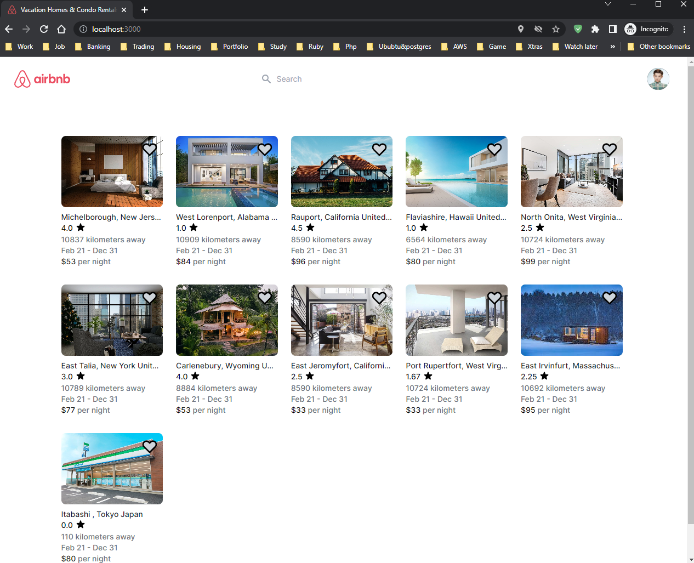
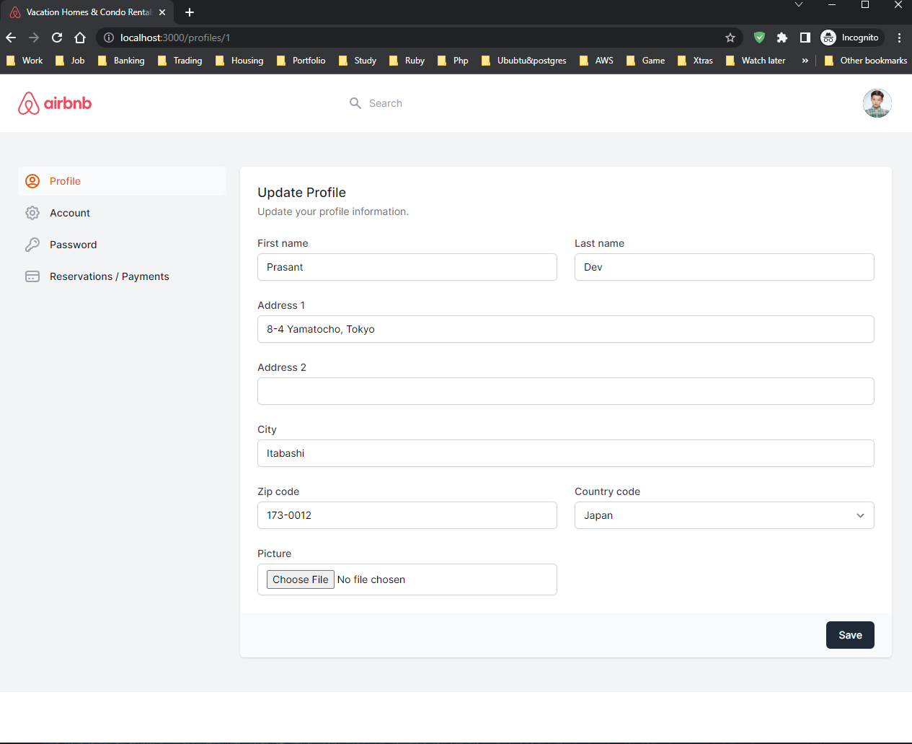
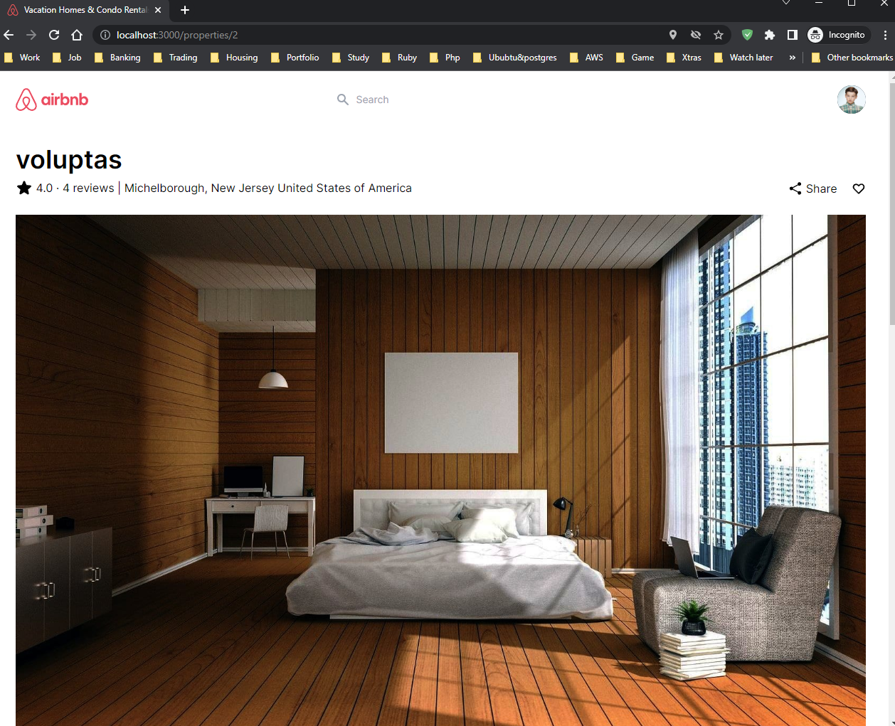
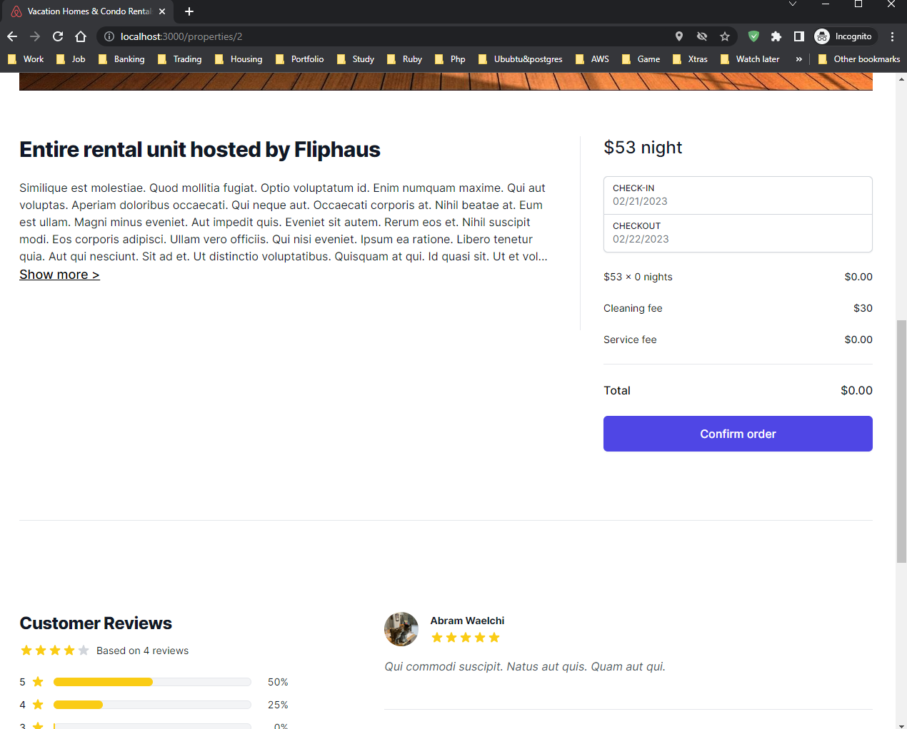
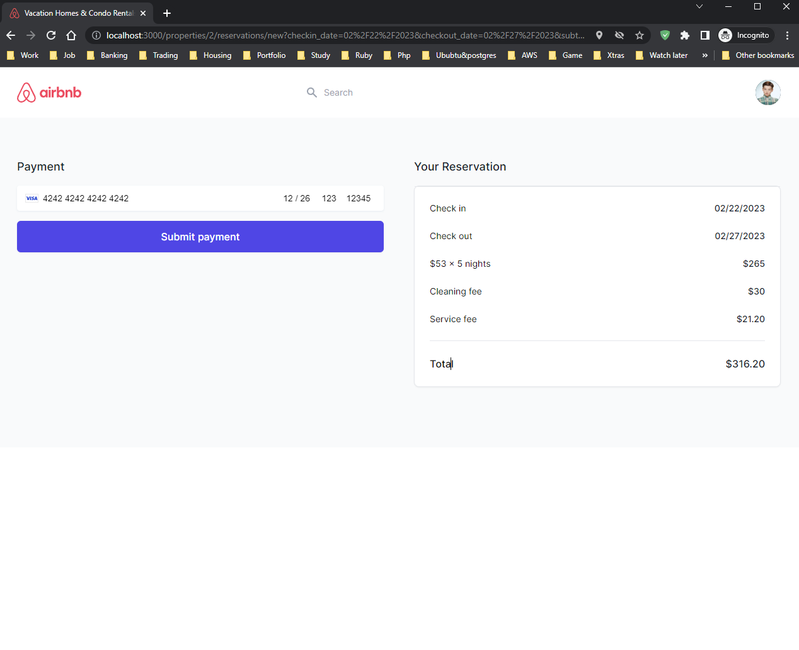
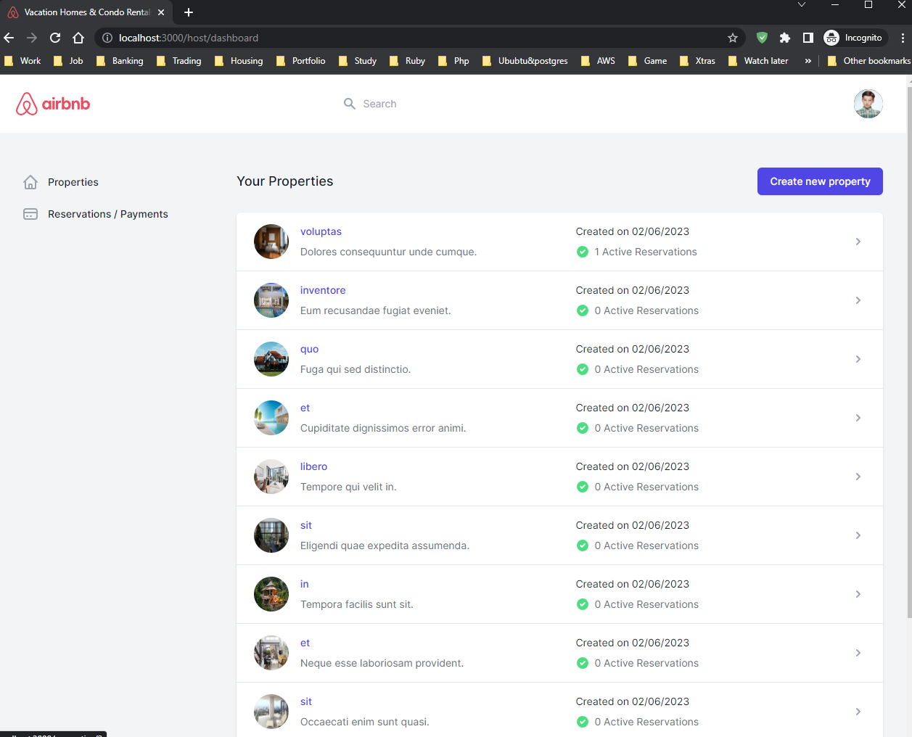

# Hotel/Property Reservation System (Airbnb Cloning with Ruby on Rails)

## Description

This is a hotel/property reservation system build using Ruby on rails. I've assembled this projects with best-practices, tweaks, documentation, and personal preferences, while still generally adhering to the "Rails way".

In this application you can:

- You can Sign-Up/Sign-in/Sign-out as a user.
- Reserve a property on desired date and time.
- Add your on property with desired date/time/money.
- Make real like payment with Stripe API payment system.
- View the distance of the property from your location or certaion user location.
- Favourite/Unfavourite a property.
- Edit/update your profile information and picture.
- check the property in developer mode google map.
- View your reservations or added property.
- View the payments made through renting/leasing a property.
- Host dashboard.
- Review System.
- Social Media share system.

## Tech Stack && Installation

- [RVM](https://rvm.io/)
- [Ruby 3.0.x/Rails 7.0.x](https://www.ruby-lang.org/en/documentation/installation/)
- [PostgreSQL](https://www.postgresql.org/download/)
- [Docker](https://docs.docker.com/get-docker/)
- [Stripe Payment API](https://stripe.com/global/)
- [Stripe card testing](https://stripe.com/docs/testing/)
- [Devise](https://github.com/heartcombo/devise/)
- [Rspec](https://github.com/rspec/rspec-rails/)
- [Vanilla JS Datepicker](https://mymth.github.io/vanillajs-datepicker/#/)
- [Tailwind CSS](https://tailwindcss.com/docs/guides/ruby-on-rails/)
- [Tailwind UI](https://tailwindui.com/)
- [Hotwire](https://hotwired.dev/)
- [Turbo](https://turbo.hotwired.dev/)
- [StimulusJS](https://stimulus.hotwired.dev/)
- [Pundit](https://github.com/varvet/pundit/)
- [Google Map API](https://developers.google.com/maps/)
- [Faker](https://github.com/faker-js/faker/)
- [axios](https://github.com/axios/axios/)
- [el-transition](https://github.com/mmccall10/el-transition/)
- [Factory Bot Rails](https://github.com/thoughtbot/factory_bot_rails/)
- [Geolib](https://github.com/manuelbieh/geolib/)
- [Sweetalert2](https://sweetalert2.github.io/)
- [Heroicons](https://heroicons.com/)
- [Loadash-es](https://www.npmjs.com/package/lodash-es)
- [Bundler 2.0.x](https://bundler.io/)

## Usage

Sign up as a user and reserve or lease a property accordingly. With stripe payment API, you can have a similar experience as a e-commerce site payment.

To clone this template Rails application enter the following command:

```
git clone https://github.com/kastokniv/airbnb_clone_ruby_on_rails.git
```

## .env file

Use .env.example after renaming it to .env. Also, you need to get your own necessary authentication key and passwords accordingly.

## After cloning

Enter the following command in the terminal to dockerize the app and running:

```
docker-compose build
```

```
docker-compose run web rails db:create
```

```
docker-compose run web rails db:migrate db:test:prepare
```

If there is any problem try

```
 docker-compose run web bundle exec rails db:reset
```

You can use the app as brand new, Or for seeded data run below command

```
 docker-compose run web rails  db:seed
```

FInally,

```
docker-compose up
```

## Result

You can check the Reservation site on your localhost
`localhost:3000`







